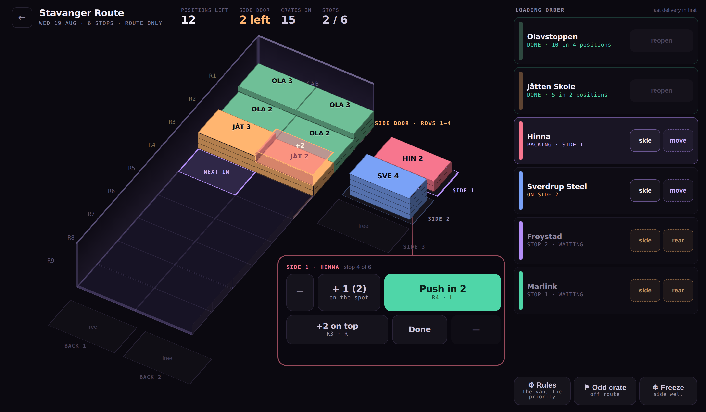

# Live load board — working demo

A clickable board for loading the van when there is no generated plan. It draws
the van **from its own rear-right corner** — the corner you are standing at with
the back doors open — so the left column is on the left, the right column is on
the right, the side door and its packing spots are at the far end on the right,
and the back spots are on the ground in front of you. Stack height is drawn as
height: the ±3 rule is why the van reads as a staircase rather than a wall.

Open it, tap through it, and switch between three levels of scanning to see how
much foresight each one buys.



## Running it

The demo is one self-contained file. No build, no server, no dependencies:

```bash
xdg-open docs/design/sorting-live/demo.html     # or just double-click it
```

If you would rather serve it (handy for testing from the tablet on the same
network):

```bash
npx http-server docs/design/sorting-live -p 8080     # then http://<your-ip>:8080/demo.html
```

It is authored at exactly **1440 × 840 CSS px** — the Movink Pad Pro in
landscape, after Chrome's URL bar. A narrower window scales the whole board
rather than reflowing it, so what you tap here is what you tap there.

## The three test cases

The buttons along the top swap what was known before the doors opened. The
board, the state and your progress stay the same — only the foresight changes.

| Case | What you gave it | What it can tell you |
|---|---|---|
| **Customer order only** | the route list | nothing until you tap it in: every count, position and stack height is decided at the pallet |
| **Order + crate counts** | plus a total per customer | the whole van planned up front — every empty position shows, in blue, who belongs there and how many |
| **Everything scanned** | plus which pallet each order is on | the console also names the pallet to pull from next |

The plan the middle case draws is produced by running the *live* rules forward
over the known counts — same window, same split, same fill order — so a route
sorted with a manifest and one sorted blind end up in the same van.

## The flow

The route runs down the right in **loading order** — last delivery in first.
Every stop carries two buttons, and which door you pack it at is the only choice
the board cannot make for you.

1. **`side`** or **`rear`** on a stop. That claims a packing spot, and the pile
   you build on it is drawn standing on the pavement outside the van.
2. **`+ 1`** for each crate you put on the spot. Optional — a push with nothing
   counted records an unknown rather than a guess, and says so.
3. **`Push in`** commits that pile to one van position. Tap it again for the next
   position: a ten-crate order comes out 5 + 5 across one row, two taps.
4. **`+n on top`** puts a small order, or one leftover crate, on an existing
   stack instead. The crates are drawn where they would land before you commit.
5. **`Done`** when there are no more crates. The dock hands itself to whoever is
   on a spot next.

The controls live in one **dock** standing on the pavement between the two
clusters of packing spots — where the driver is actually standing — tethered by
a line to whichever spot it is driving and bordered in that customer's colour.
It never moves, because the push button is tapped once per position for a whole
load and a control that jumps between five pads is a mis-tap generator.

## What to try

- Tap **Push in 2** on Hinna, then **Done**. Two taps for a two-crate stop.
- Give Sverdrup nine crates and push: it offers **5 of 9**, holds the next
  position for the rest, and the second tap uses it.
- Fill rows 1–4 and watch the sill go red and the side buttons go dashed. Start
  a stop at the side anyway and the push becomes **Carry round the back**, which
  moves the half-built stack to a back spot, crates and all.
- Give Marlink three crates against Sverdrup's seven. The push goes amber, and
  the board offers Hinna's stack instead — in amber, saying what mixing costs.
- Tap an empty position the door can still reach: it becomes the target, and the
  board says what the gap will cost. Tap a stack and the top-up goes there.
- Switch to **Order + crate counts** and watch the empty positions fill with
  translucent blue volumes — what the plan says belongs there.
- Work both doors at once: put Olavstoppen in through the rear, tap **Done**,
  then start Jåtten at the side. The push goes amber and names the unload it
  would cost — the loading-order guard never caught that one, because pressing
  Done dissolves it.
- Push twice without counting. The button stays grey, the van shows `?`, and the
  headline switches from **CRATES IN** to **POSITIONS IN · 2 blind** rather than
  reporting nought crates with two stacks aboard.
- Hit **Start over** to reset.

## Rebuilding

```bash
node docs/design/sorting-live/build.mjs      # src/ -> demo.html
node docs/design/sorting-live/src/model.test.js
node docs/design/sorting-live/src/board.test.js
```

`src/model.js` is the whole rule set — fill order, the ±3 window, splitting,
combining, the doors, the doorways, and the live packing verbs (`beginState`,
`doBegin`, `doMoveSpot`, `stackHosts`, `topUpState`). `src/board.js` projects it
into the picture and the controls. `src/board.html` is the markup, shared
verbatim with the design canvas; `src/runtime.js` is the ~70-line template
runtime that renders it, so the demo and the design cannot drift apart.

The two test files run on plain `node` with no dependencies — 316 checks over
the rules, the rendering, and the geometry. The geometric ones matter more than
they look: a sheared box reports its *untransformed* rectangle to the browser,
so the only way to know the van has not been drawn out through the side of the
frame is to multiply its corners through the matrix, which `board.test.js` does
for every part of the picture, at seven, nine and eleven rows and with the van
stacked to the roof.
